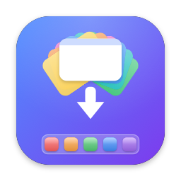
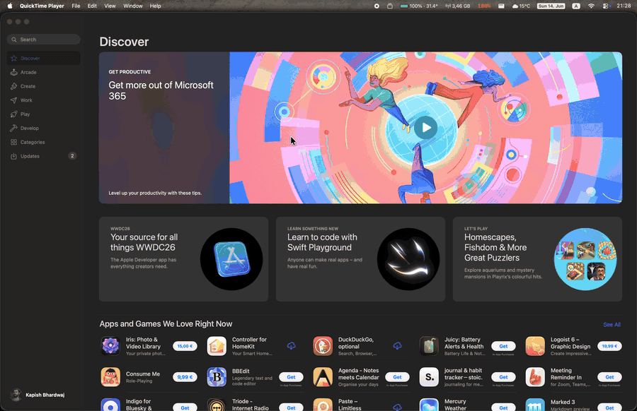

<p align="center">
  
</p>

<h1 align="center">macOS-Minimizer</h1>

<p align="center">
  <strong>Minimize every normal macOS window and restore your workspace with one hotkey.</strong>
</p>

<p align="center">
  <a href="https://github.com/onekapisch/macOS-Minimizer/releases/latest"><strong>Download latest release</strong></a>
</p>

[](https://github.com/onekapisch/macOS-Minimizer/actions/workflows/ci.yml)
[](LICENSE)

Minimizer is a native macOS menu-bar app that minimizes every normal window to the
Dock, then restores those windows and returns focus to the window you were using.

It exists for people who want a true minimize-and-restore workflow on macOS, not
Mission Control's temporary Show Desktop gesture and not app hiding.

<p align="center">
  
</p>

## Features

- Global hotkey for minimize/restore.
- Menu-bar-only app with no Dock icon.
- Direct Accessibility window control through `kAXMinimizedAttribute`.
- Restore set tracking so already-minimized windows are left alone.
- Focus restoration to the originally active window.
- First-run onboarding for Accessibility permission.
- Settings window for hotkey recording and Launch at Login.
- No telemetry, no analytics, and no network behavior.

## Requirements

- macOS 13 or newer.
- Accessibility permission granted to Minimizer at runtime.

## Install

Download `Minimizer-v1.0.0.zip` from the [latest GitHub Release](https://github.com/onekapisch/macOS-Minimizer/releases/latest), unzip it, move `Minimizer.app` to Applications, and launch it.

On first launch, macOS will ask for Accessibility permission. Grant it in System
Settings so Minimizer can minimize, restore, and focus windows from other apps.

## Build From Source

- Xcode command line tools.
- Swift 5.9 or newer.
- XcodeGen for regenerating `Minimizer.xcodeproj`.

Clone the repository and build the app bundle:

```sh
git clone https://github.com/onekapisch/macOS-Minimizer.git
cd macOS-Minimizer
swift build -c release
./build_app.sh
open "Minimizer.app"
```

## Development

Run the SwiftPM path:

```sh
swift test
swift build -c release
./build_app.sh
```

Regenerate and build the Xcode project:

```sh
xcodegen generate
xcodebuild -project Minimizer.xcodeproj -scheme Minimizer -configuration Release -destination 'platform=macOS' CODE_SIGNING_ALLOWED=NO build
```

The Xcode project is generated from `project.yml`. After adding or removing source
files, run `xcodegen generate`.

## Privacy

Minimizer does not collect, transmit, or retain document contents. Window
references stay in memory for the active minimize/restore cycle and are cleared
after restore. See `SECURITY.md` for the full security and data handling notes.

## Distribution

Public binary releases are Developer ID-signed, notarized, and attached to GitHub
Releases. The project is not targeting the Mac App Store because the app needs
direct Accessibility control over other apps' windows.

See `RELEASE_PLAN.md` for the release checklist.

## Contributing

Bug reports and focused pull requests are welcome. Please keep changes scoped and
preserve the direct Accessibility minimize/restore engine documented in `AGENTS.md`.

## License

macOS-Minimizer is licensed under the MIT License. See `LICENSE`.
